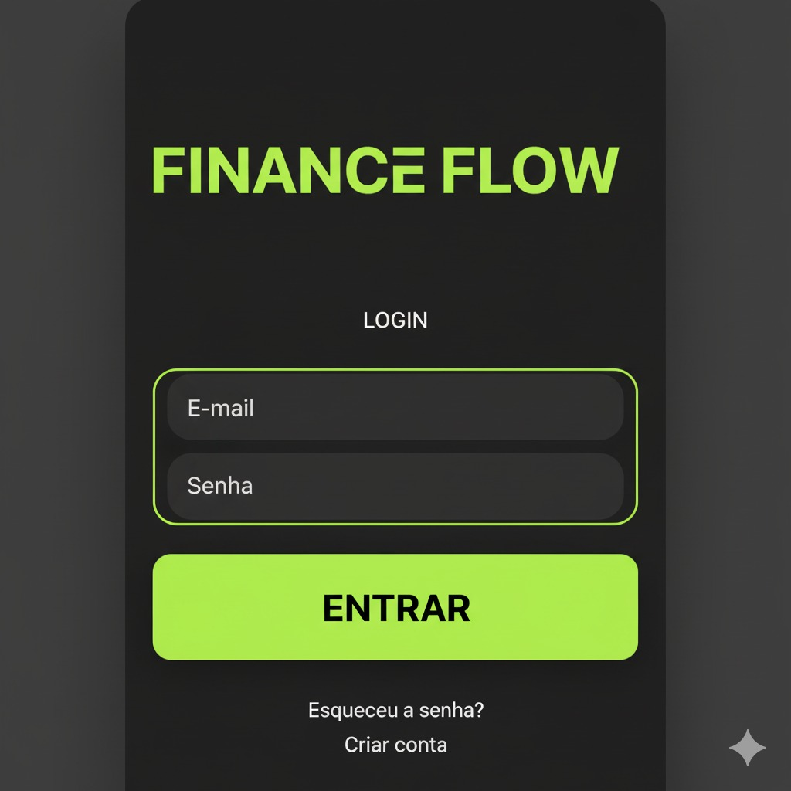
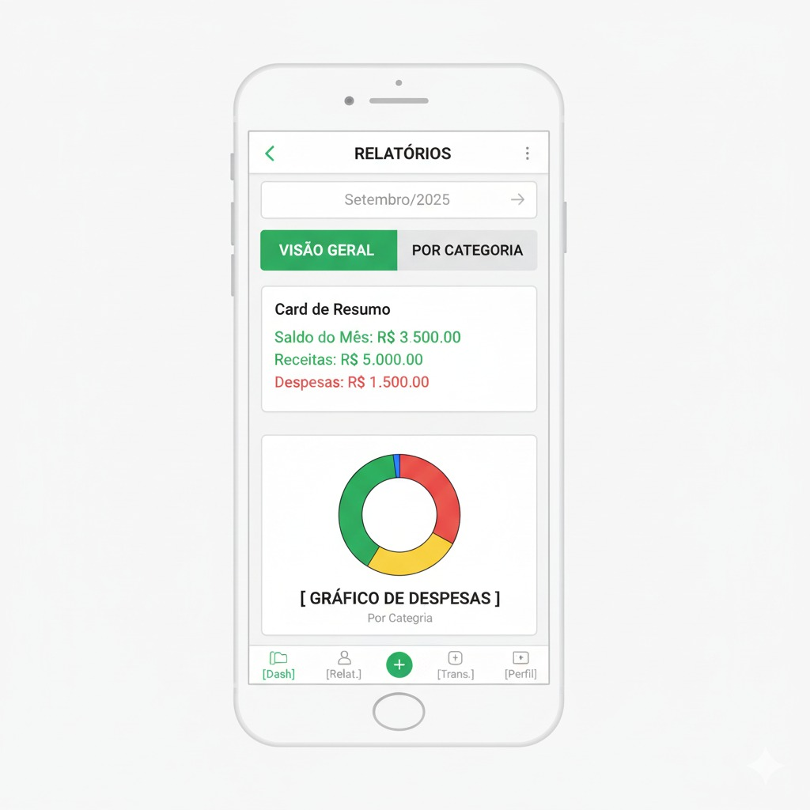
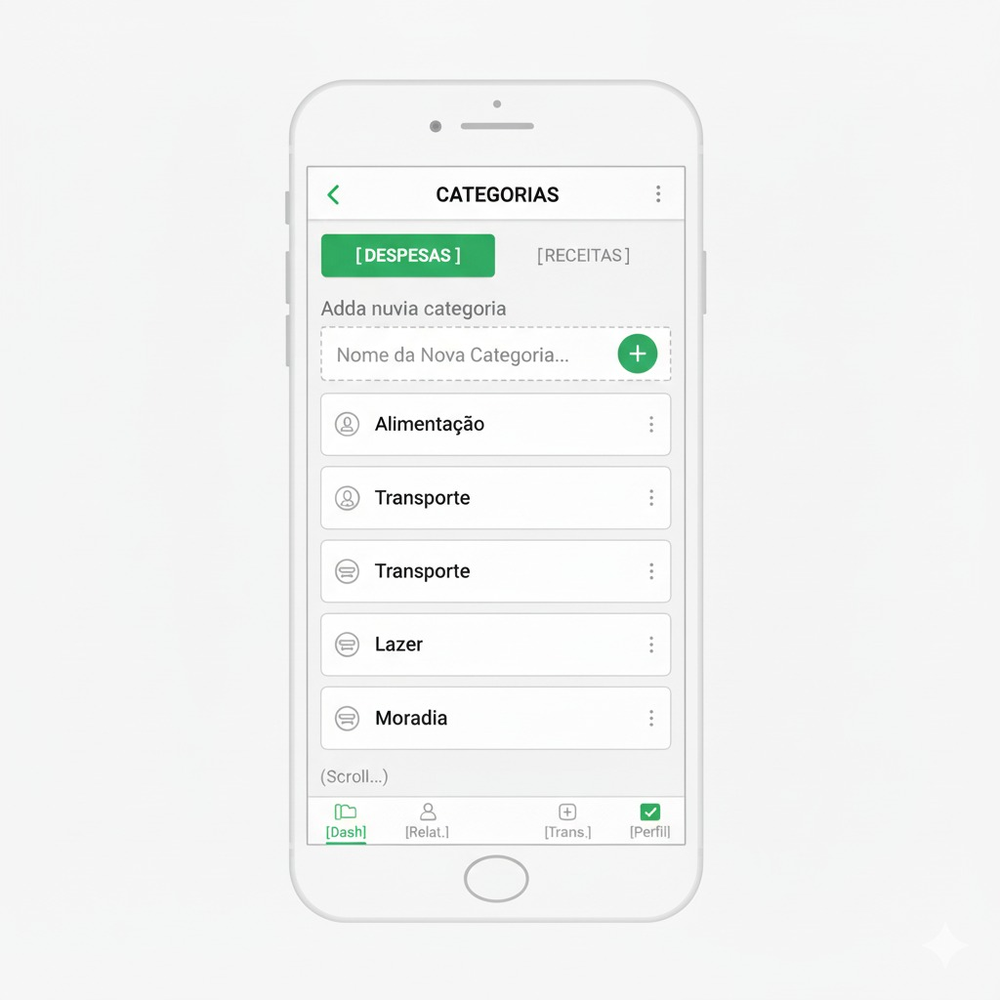
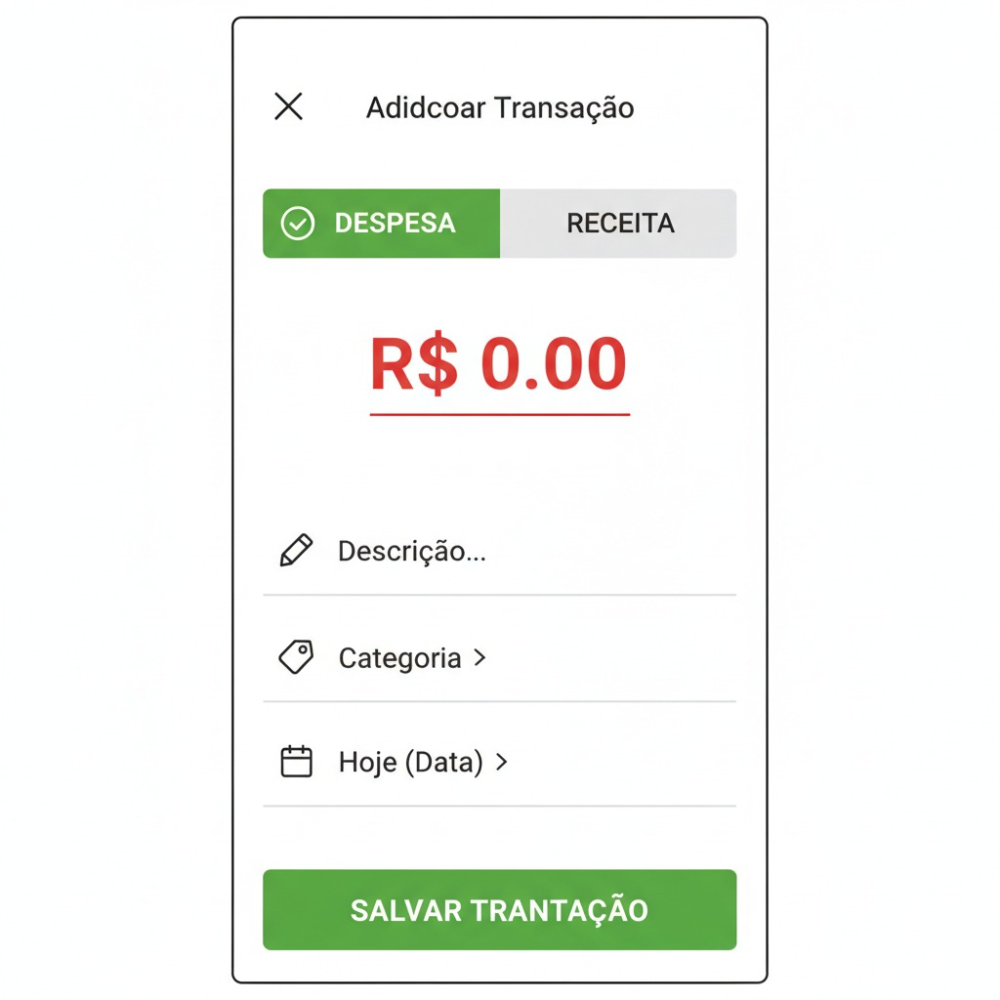
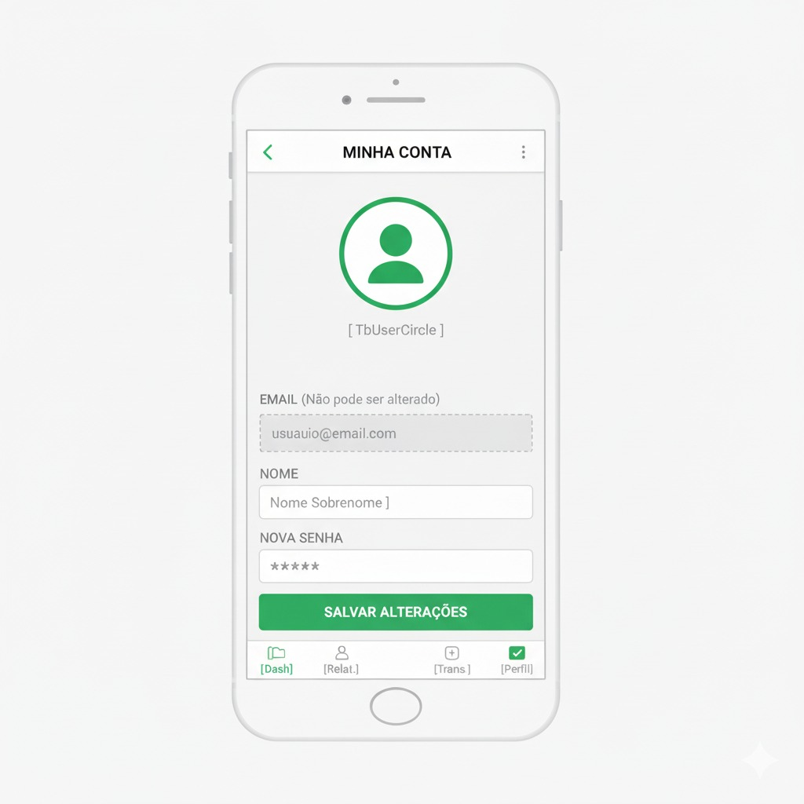

# Front-end Móvel
Flow é uma plataforma de gerenciamento de finanças pessoais projetada sob uma arquitetura de sistemas distribuídos. O ecossistema é composto por três pilares integrados: um aplicativo móvel (React Native) focado na experiência do usuário final para lançamentos rápidos, um portal administrativo web (React) para gestão e monitoramento da plataforma, e uma API RESTful robusta (Node.js) que centraliza a lógica de negócios e a persistência de dados.

O objetivo central do projeto é democratizar o controle financeiro através de uma ferramenta simples e eficiente, permitindo que usuários registrem despesas, receitas e visualizem sua saúde financeira através de relatórios categorizados. A solução prioriza a segurança e a integridade dos dados, implementando autenticação via tokens JWT e garantindo que cada usuário tenha acesso exclusivo e isolado às suas próprias informações financeiras.

Do ponto de vista acadêmico e técnico, o projeto visa demonstrar a implementação prática de uma arquitetura moderna e escalável. Ele utiliza tecnologias de ponta como TypeScript, Prisma ORM e PostgreSQL, além de práticas de DevOps com Docker, exemplificando a separação clara de responsabilidades entre front-end, back-end e banco de dados em um ambiente distribuído.

## Projeto da Interface
O desenvolvimento da interface móvel do **Flow** foi norteado pela premissa de oferecer uma experiência de usuário fluida, intuitiva e focada na agilidade do registro de informações. Construído com **React Native** e estilizado via **NativeWind**, o aplicativo atua como o ponto de contato primário para o usuário final, permitindo que o controle financeiro seja realizado em tempo real, diretamente do dispositivo móvel.

A estrutura de navegação foi desenhada para minimizar a carga cognitiva, utilizando uma **Barra de Navegação Inferior (Bottom Tab Bar)** para acesso rápido às áreas principais (Dashboard, Add Transação e Categorias) e **Modais** sobrepostos para ações de alta frequência, como a adição de novas transações. O design visual adota um tema escuro (*Dark Mode*) consistente com o Portal Administrativo, utilizando contrastes de verde neon para guiar a atenção do usuário aos elementos de ação e indicadores de saúde financeira.

Em termos de interação, a interface prioriza o *feedback* imediato e a visualização de dados. Gráficos interativos de barras e rosca (Donut) foram implementados para transformar dados brutos em insights visuais instantâneos. O fluxo de telas foi otimizado para garantir que tarefas críticas, como o lançamento de uma despesa, possam ser concluídas com o mínimo de toques possível, garantindo a eficiência da aplicação em cenários de uso cotidiano.

### Wireframes

### Design Visual

## Fluxo de Dados

## Tecnologias Utilizadas

| Categoria | Tecnologia | Propósito no Projeto |
| :--- | :--- | :--- |
| **Base (Core)** | **React Native** | Framework principal para o desenvolvimento da interface nativa (iOS e Android) utilizando a lógica do React. |
| **Base (Core)** | **TypeScript** | Garante a tipagem estática, aumentando a segurança do código e facilitando a manutenção e refatoração. |
| **Base (Core)** | **Expo** | Plataforma que agiliza o desenvolvimento, build e teste, fornecendo acesso fácil a APIs nativas (como SecureStore). |
| **Estilização** | **NativeWind** | Traz o poder do Tailwind CSS para o React Native, permitindo estilização rápida via classes diretamente no JSX. |
| **Navegação** | **React Navigation** | Gerencia todo o fluxo de navegação do app, implementando Pilhas (Stack) para telas modais e Abas (Bottom Tabs) para o menu principal. |
| **Ger. de Estado** | **React Context API** | Usado no `AuthContext` para gerenciar globalmente a sessão do usuário (login, logout e persistência de token). |
| **Ger. de Estado** | **React Hooks** | `useState`, `useEffect`, `useCallback` e o específico `useFocusEffect` são usados para controlar o ciclo de vida e reatividade das telas. |
| **Formulários** | **React Hook Form** | Gerencia o estado dos formulários (Login, Cadastro) de forma performática, reduzindo a necessidade de múltiplos estados manuais. |
| **Validação** | **Zod** | Utilizado para criar esquemas de validação robustos, integrando-se ao React Hook Form para validar dados antes do envio. |
| **Comunicação API** | **Axios** | Cliente HTTP para realizar as requisições REST ao back-end, configurado para injetar automaticamente o token JWT. |
| **Armazenamento** | **Expo SecureStore** | Armazenamento local criptografado, utilizado para persistir o Token JWT e dados sensíveis do usuário de forma segura. |
| **Armazenamento** | **AsyncStorage** | Armazenamento local simples chave-valor, usado para persistir preferências não sensíveis, como o status de visualização do tutorial. |
| **Visualização** | **RN Gifted Charts** | Biblioteca utilizada para renderizar os gráficos interativos (Barras e Rosca) no Dashboard de forma nativa e animada. |
| **Onboarding** | **RN Copilot** | Biblioteca para criar o tutorial passo-a-passo (Walkthrough) que guia novos usuários pelas funcionalidades principais. |
| **Onboarding** | **RN Copilot** | Biblioteca para criar o tutorial passo-a-passo (Walkthrough) que guia novos usuários pelas funcionalidades principais. |
| **Iconografia** | **Lucide React Native** | Conjunto de ícones vetoriais modernos e consistent

## Considerações de Segurança
 A segurança do **Flow** foi projetada em camadas 
("Defense in Depth"), garantindo que a proteção dos 
dados financeiros e pessoais dos usuários seja 
mantida desde a interface do usuário até o banco de 
dados.
 Abaixo estão as estratégias implementadas para 
mitigar riscos e garantir a integridade da aplicação 
distribuída.
 #### Autenticação e Gerenciamento de Sessão
 A autenticação é a porta de entrada do sistema e 
utiliza padrões modernos para garantir que apenas 
usuários legítimos acessem a plataforma.- Padrão JWT (JSON Web Token): A API utiliza tokens 
JWT assinados com uma chave secreta (JWT_SECRET) 
mantida apenas no servidor. O token é stateless (sem 
estado), o que permite que a API escale 
horizontalmente sem depender de sessões em memória.- Criptografia de Senhas: As senhas nunca são 
armazenadas em texto plano. Utilizamos a biblioteca 
Bcrypt para realizar o hashing das senhas com um salt 
aleatório antes da persistência no banco de dados, 
protegendo contra ataques de rainbow table.- Armazenamento Seguro (Mobile): No aplicativo React 
Native, o token JWT não é salvo em armazenamento 
comum. Utilizamos o Expo SecureStore, que aproveita o 
Keychain (iOS) e o Keystore (Android) para 
criptografar o token no dispositivo do usuário.- Contexto de Autenticação: O front-end (Web e 
Mobile) utiliza um AuthContext centralizado que 
gerencia o ciclo de vida do token, garantindo o 
logout automático e a limpeza de dados sensíveis da 
memória quando necessário.
#### Autorização e Controle de Acesso (RBAC)
 Apenas estar logado não é suficiente; o sistema 
verifica o que o usuário pode fazer.- Role-Based Access Control (RBAC): O sistema 
implementa dois níveis de acesso distintos:
  - member: Acesso restrito apenas aos seus próprios 
dados (transações, categorias, perfil).
  - admin: Acesso privilegiado ao Portal 
Administrativo para visualização de métricas globais 
e gestão de usuários.- Middleware de Proteção: As rotas críticas são 
protegidas por middlewares (ensureAuthenticated e 
verifyUserAuthorization) que interceptam a 
requisição, validam o token e verificam se a role do 
usuário permite o acesso ao recurso solicitado.- Isolamento de Dados (Propriedade): A segurança é 
aplicada no nível da consulta ao banco de dados. Todo 
comando de leitura ou escrita inclui a cláusula 
where: { userId: request.user.id }. Isso garante 
matematicamente que um usuário jamais consiga ler ou 
manipular transações de outro usuário, mesmo que 
tente forjar IDs na URL.
 #### Proteção Contra Ataques Comuns
 A arquitetura foi desenhada para mitigar as 
vulnerabilidades mais comuns listadas no OWASP Top 
10.- Prevenção de SQL Injection: A utilização do Prisma 
ORM elimina o risco de injeção de SQL. O Prisma 
utiliza prepared statements (consultas 
parametrizadas) por padrão, tratando todos os inputs 
do usuário como dados literais e nunca como comandos 
executáveis.- Validação e Sanitização de Dados: A biblioteca Zod 
atua como um guardião na entrada da API. Todos os 
dados recebidos (body, query, params) são validados 
contra um esquema estrito. Dados malformados, tipos 
incorretos ou campos inesperados são rejeitados 
imediatamente com erro 400 Bad Request, impedindo que 
dados "sujos" entrem na lógica de negócio.- Tratamento de Erros Seguro: A API implementa uma 
camada global de tratamento de erros (AppError). 
Erros internos do servidor ou falhas de banco de 
dados não expõem stack traces ou detalhes sensíveis 
da infraestrutura para o cliente; apenas mensagens 
genéricas e códigos de status HTTP apropriados são 
retornados.
- Tratamento de Erros Seguro: A API implementa uma 
camada global de tratamento de erros (AppError). 
Erros internos do servidor ou falhas de banco de 
dados não expõem stack traces ou detalhes sensíveis 
da infraestrutura para o cliente; apenas mensagens 
genéricas e códigos de status HTTP apropriados são 
retornados.
 #### Segurança da Infraestrutura e Comunicação- HTTPS/TLS: Em produção (Render), toda a comunicação 
entre os clientes (Mobile/Web) e a API é forçada via 
HTTPS, garantindo a criptografia dos dados em 
trânsito e protegendo contra ataques Man-in-the
Middle.- Variáveis de Ambiente: Segredos como credenciais de 
banco de dados e chaves de assinatura JWT são 
injetados em tempo de execução através de variáveis 
de ambiente, nunca sendo "commitados" no código-fonte 
(repositório).- Containerização (Docker): O uso do Docker garante 
que a aplicação rode em um ambiente isolado e 
controlado, com versões específicas de dependências, 
reduzindo a superfície de ataque do sistema 
operacional

## Implantação

## Testes

# Planejamento

##  Quadro de tarefas

### Semana 1

Atualizado em: 08/11/2025

| Responsável   | Tarefa/Requisito | Iniciado em    | Prazo      | Status | Terminado em    |
| :----         |    :----         |      :----:    | :----:     | :----: | :----:          |
| Thiago Ferreira | Wireframes | 03/11/2025 | 08/11/2025 | ✔️ | 08/11/2025      |
| André Ramos | Estudo da Segurança |  03/11/2025 | 08/11/2025 | 📝 | ----
| Gustavo Gino | Tipografia |  03/11/2025 | 08/11/2025 | ✔️ | 08/11/2025 |
| Lucas Borges | Adequação API |  03/11/2025 | 08/11/2025 | 📝 | ---- |
| Natã Gabriel | Tecnologias |  03/11/2025 | 08/11/2025 | 📝 | ---- |
| Rhafael Hector | Design IU/UX |  03/11/2025 | 08/11/2025 | 📝 | ---- |

#### Semana 2

Atualizado em: 15/11/2025

| Responsável   | Tarefa/Requisito | Iniciado em    | Prazo      | Status | Terminado em    |
| :----         |    :----         |      :----:    | :----:     | :----: | :----:          |
| Thiago Ferreira | Desenvolvimento | 09/11/2025 | 15/11/2025 | 📝 | ----      |
| André Ramos | Desenvolvimento | 09/11/2025 | 15/11/2025 | 📝 | ----
| Gustavo Gino | Tipografia | 09/11/2025 | 15/11/2025 | ✔️ | 08/11/2025 |
| Lucas Borges | Adequação API | 09/11/2025 | 15/11/2025 | 📝 | ---- |
| Natã Gabriel | Tecnologias | 09/11/2025 | 15/11/2025 | 📝 | ---- |
| Rhafael Hector | Design IU/UX | 09/11/2025 | 15/11/2025 | ✔️ | 15/11/2025 |

#### Semana 3

Atualizado em: 22/11/2025

| Responsável   | Tarefa/Requisito | Iniciado em    | Prazo      | Status | Terminado em    |
| :----         |    :----         |      :----:    | :----:     | :----: | :----:          |
| Thiago Ferreira | Desenvolvimento | 16/11/2025 | 22/11/2025 | 📝 | ----      |
| André Ramos | Desenvolvimento | 16/11/2025 | 22/11/2025 | ✔️ | 22/11/2025
| Gustavo Gino | Verificar Tipografia | 16/11/2025 | 22/11/2025 | ✔️ | 22/11/2025 |
| Lucas Borges | Adequação API | 16/11/2025 | 22/11/2025 | 📝 | ---- |
| Natã Gabriel | Tecnologias | 16/11/2025 | 22/11/2025 | ✔️ | 22/11/2025 |
| Rhafael Hector | Design IU/UX | 16/11/2025 | 22/11/2025 | ✔️ | 15/11/2025 |

#### Semana 4

Atualizado em: 29/11/2025

| Responsável   | Tarefa/Requisito | Iniciado em    | Prazo      | Status | Terminado em    |
| :----         |    :----         |      :----:    | :----:     | :----: | :----:          |
| Thiago Ferreira | Desenvolvimento | 23/11/2025 | 29/11/2025 | ✔️ | 29/11/2025      |
| André Ramos | Desenvolvimento | 23/11/2025 | 29/11/2025 | ✔️ | 22/11/2025
| Gustavo Gino | Verificar Tipografia | 23/11/2025 | 29/11/2025 | ✔️ | 22/11/2025 |
| Lucas Borges | Adequação API | 23/11/2025 | 29/11/2025 | ✔️ | 29/11/2025 |
| Natã Gabriel | Tecnologias | 23/11/2025 | 29/11/2025 | ✔️ | 22/11/2025 |
| Rhafael Hector | Design IU/UX | 23/11/2025 | 29/11/2025 | ✔️ | 15/11/2025 |

Legenda:
- ✔️: terminado
- 📝: em execução
- ⌛: atrasado
- ❌: não iniciado

