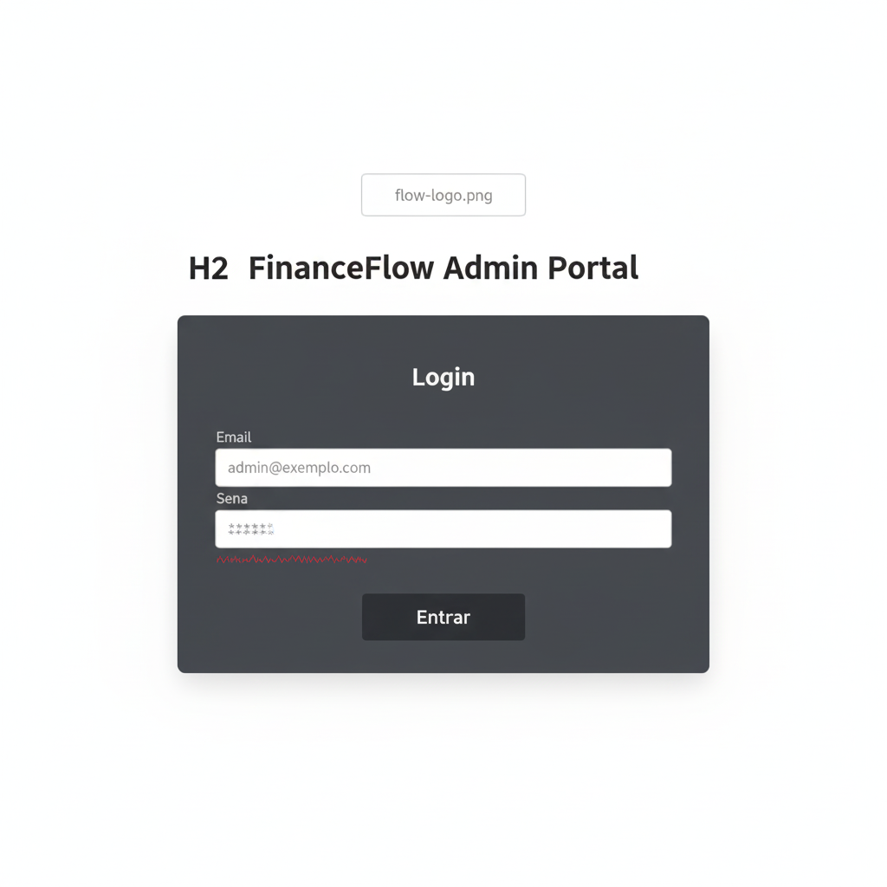
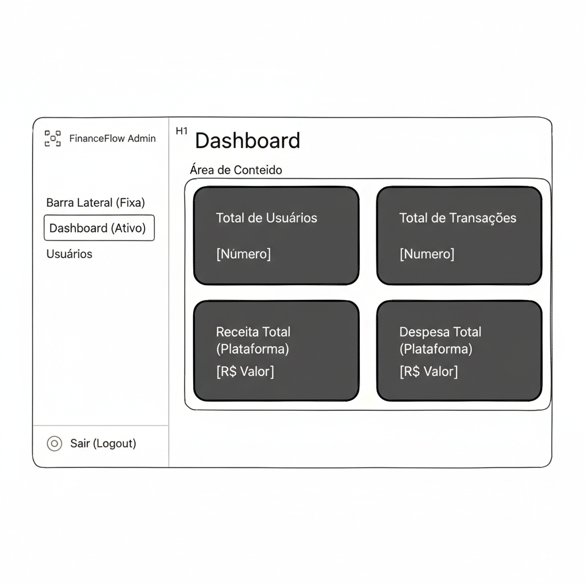
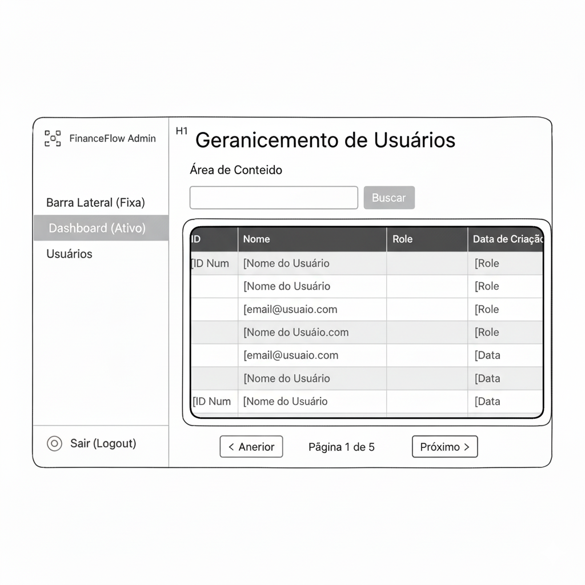
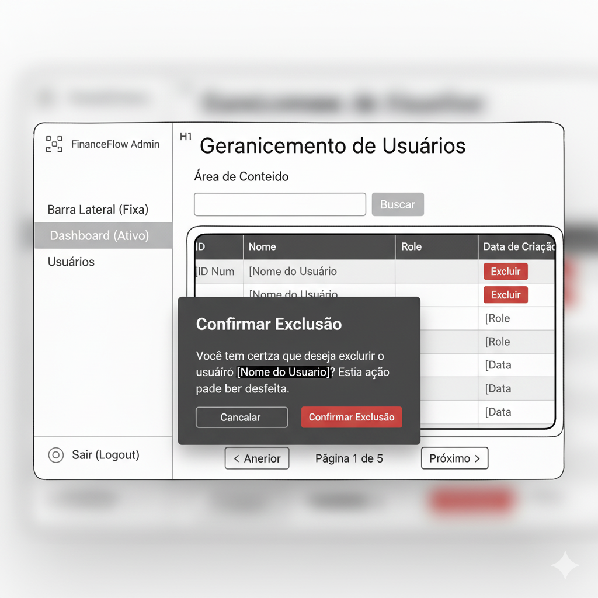

# Front-end Web

Esta documentação refere-se ao desenvolvimento Frontend do portal administrativo web, a ser acessado pelo administrador da plataforma.

## Projeto da Interface Web

Este documento detalha o desenvolvimento da interface web (Front-end) do Portal Administrativo **Flow**. Esta aplicação é um Single Page Application (SPA) construída em React com TypeScript e estilizada com Tailwind CSS.

### Wireframes

### Design Visual

Tipografia:

Paleta De Cores:

Design das Telas:

## Fluxo de Dados

### Fluxo 1
1. O usuário entra no sistema (insere e-mail e senha na página SignIn.tsx e clica em entrar). 

2. Os dados do formulário são validados localmente usando Zod.

3. Uma requisição POST /sessions é enviada à API com os dados.

4. O AuthProvider armazena o token e user no localStorage

5. A instância global do api (Axios) é atualizada com o cabeçalho Authorization: Bearer [token]

6. O AppRoutes detecta que session não é mais null e que o role é "admin".

7. O React Router redireciona automaticamente o usuário da rota / para /admin/dashboard e o usuário recebe um popup na tela ("Login efetuado com sucesso")

### Fluxo 2
1. As próximas páginas buscam os dados da API confirmando que o session do AuthContext é válido e renderizando as páginas Dashboard.tsx e UserListPage.tsx

## Tecnologias Utilizadas

O Portal Administrativo foi construído como uma Single Page Application (SPA) moderna, utilizando um conjunto de tecnologias focado em desempenho, manutenibilidade e uma excelente experiência de desenvolvimento.

A tabela abaixo detalha as principais bibliotecas e frameworks utilizados no projeto:

| Categoria   | Tecnologia | Propósito no Projeto    |
| :----         |    :----         |      :----    |
| Base (Core)       | React | Biblioteca principal para a construção da interface de usuário declarativa e baseada em componentes.
| Base (Core)       | TypeScript    | Garante a tipagem estática, aumentando a segurança do código, melhorando o IntelliSense e facilitando a refatoração.              |
| Build Tool        | Vite  | Ferramenta de build moderna que oferece Hot Module Replacement (HMR) instantâneo e builds de produção otimizados. |
| Estilização        | Tailwind CSS  |    Framework utility-first para estilização rápida e consistente diretamente no JSX, permitindo a criação de um design system customizado. |
| Estilização | tailwindcss-animate | Plugin do Tailwind para adicionar animações de entrada/saída (animate-in, fade-in) de forma declarativa. |
| Iconografia | react-icons | Biblioteca para a inclusão de ícones (como HiMenu, TbUserCircle, HiPlus) de forma otimizada. |
| Roteamento | React Router DOM | Utilizado para gerenciar a navegação entre as páginas (Login, Dashboard, Usuários, Perfil) e para a criação de Rotas Protegidas. |
| Ger. de Estado | React Context API | Usado especificamente no AuthContext para gerenciar globalmente o estado da sessão do usuário (token, dados do usuário, status de isLoading). |
| Ger. de Estado | React Hooks | useState, useEffect, useContext, useRef, useCallback e useActionState são usados para gerenciar o estado local das páginas e componentes. |
| Comunicação API | Axios | Cliente HTTP baseado em Promises (abstraído no serviço api.ts) para realizar requisições seguras (com Bearer Token) aos endpoints da API. |
| Notificação | react-hot-toast | Biblioteca para exibir notificações toast globais (sucesso, erro) de forma limpa e centralizada. |
| Validação | Zod | Utilizado no front-end para validar os dados dos formulários (Login, Perfil, Adicionar Usuário) antes do envio, garantindo feedback imediato ao usuário. |

## Considerações de Segurança

1. **Armazenamento do Token:** Cookies HTTP-only com SameSite=strict e Secure. Utilizamos também o localStorage, protegido contra XSS com políticas CSP e sanitização.

1. **Validação de Dados:** O front usa Zod, e o backend valida e sanitiza todas as entradas.

2. **Comunicação Segura:** Todas as requisições usam HTTPS para proteger credenciais e tokens.

### Autorização

1. **O cabeçalho Authorization:** Bearer [token] é definido após login. Tokens expirados forçam logout e limpeza do armazenamento.

2. **Sessão e Expiração:** Tokens de curta duração e refresh tokens seguros. Monitorados e encerrados em sessões inválidas automaticamente.

### Proteção contra ataques

1. **XSS:** Dados sanatizados evitando dangerouslySetInnerHTML.

2. **CSRF:** cookies com SameSite=strict.

3. **Força bruta:** rate limiting no backend.

4. **Mensagens e Logs:** Mensagens de erro genéricas e não expondo dados sensíveis no console.

5. **Atualizações e Deploy:** Dependências atualizadas e cabeçalhos de segurança no servidor (HSTS, CSP, X-Frame-Options, etc.).

Em resumo:

Garantimos que seja HTTPS, tokens curtos, validação em ambas as camadas, e proteção contra XSS/CSRF.
Evitando expor tokens ou dados sensíveis no front-end.

## Implantação

### Requisitos de Ambiente
1. Hardware mínimo: 1 vCPU, 512 MB de RAM e 1 GB de armazenamento.
2. Software: Node.js 18+, npm ou yarn, e um servidor HTTP (como Nginx, Vercel, Netlify ou Cloudflare Pages).

### Configuração do Ambiente

Instale as dependências do projeto com npm install.
Configure as variáveis de ambiente, como VITE_API_BASE_URL, apontando para a API de produção.

### Build e Deploy

1. Gere o build otimizado com npm run build.
2. Faça o upload do conteúdo da pasta dist/ para a plataforma de hospedagem escolhida.
3. Certifique-se de configurar o roteamento de SPA, redirecionando todas as rotas para index.html.

### Segurança e Boas Práticas
1. Utilize HTTPS e cabeçalhos de segurança (CSP, HSTS, X-Frame-Options).
2. Proteja tokens e dados sensíveis, evitando exposição no front-end.

### Validação Pós-Deploy
1. Teste o acesso à aplicação, autenticação, rotas e integração com a API.
2. Avalie o desempenho e a responsividade para garantir a estabilidade em produção.

## Testes Automatizados (Front-end)

[Acesse aqui os Arquivos dos Testes](/src/front-end/portalAdm/src/tests/)

| Arquivo de Teste | O que é o Teste (Caso de Teste) | Qual a Expectativa (Verificação) | 
| :--- | :--- | :--- | 
| `getApiErrorMessage.test.ts` | Teste Unitário: Decodificar erro do Axios (com `response.data.message`). | Retorna a mensagem específica da API (ex: "Credenciais inválidas"). | 
| `getApiErrorMessage.test.ts` | Teste Unitário: Decodificar erro padrão do JavaScript (ex: `new Error()`). | Retorna a mensagem do erro (ex: "Network Error"). | 
| `getApiErrorMessage.test.ts` | Teste Unitário: Decodificar erro desconhecido (ex: `null` ou `{}`). | Retorna a mensagem padrão (ex: "Ocorreu um erro inesperado..."). | 
| `useOutsideAlerter.test.tsx` | Teste de Hook: Simula clique **DENTRO** do elemento monitorado. | A função de *callback* (para fechar) **NÃO** é chamada. | 
| `useOutsideAlerter.test.tsx` | Teste de Hook: Simula clique **FORA** do elemento monitorado. | A função de *callback* (para fechar) **é chamada 1 vez**. | 
| `SignIn.test.tsx` | Teste de Integração: Login com credenciais corretas. | 1. Botão exibe "carregando" (`isLoading`). 2. `api.post` é chamada com `/sessions` e dados corretos. 3. `save()` do `AuthContext` é chamada com `token` e `user`. 4. `toast.success` é exibido. 5. `Maps` é chamado para `/admin/dashboard`. | 
| `AdminLayout.test.tsx` | Teste de Integração: Clique no botão "Menu Hamburger" (mobile). | 1. (Clique 1) O estado `isSidebarOpen` muda para `true`. 2. (Clique 2) O estado `isSidebarOpen` volta para `false`. | 
| `UserListPage.test.tsx` | Teste de Integração: Renderização inicial da página. | A `api.get("/admin/users")` é chamada e os dados mockados são exibidos. |
 | `UserListPage.test.tsx` | Teste de Integração: Alternar visibilidade das ações (Toggle). | 1. (Inicial) Botão "Adicionar" e coluna "Ações" não são visíveis. 2. (Após clique) Botão "Adicionar" e coluna "Ações" aparecem. 3. (Após 2º clique) Ambos desaparecem. | 
| `ProfilePage.test.tsx` | Teste de Integração: Atualização de perfil do usuário. | 1. Campos pré-preenchidos com dados do `AuthContext`. 2. Botão exibe `disabled` (loading). 3. `api.patch("/users/me")` é chamada apenas com dados alterados. 4. `save()` do `AuthContext` é chamada com os novos dados. 5. `toast.success` é exibido. |

# Planejamento

##  Quadro de tarefas

### Semana 1

Atualizado em: 12/10/2025

| Responsável   | Tarefa/Requisito | Iniciado em    | Prazo      | Status | Terminado em    |
| :----         |    :----         |      :----:    | :----:     | :----: | :----:          |
| Thiago Ferreira | Wireframes | 06/10/2025 | 12/10/2025 | ✔️ | 12/10/2025      |
| André Ramos | Estudo da Segurança | 06/10/2025 | ---- | 📝 | ----
| Gustavo Gino | Tipografia | 06/10/2025 | 12/10/2025 | ✔️ | 12/10/2025 |
| Lucas Borges | Fecths | 06/10/2025 | ----- | 📝 | ---- |
| Natã Gabriel | Tecnologias | 06/10/2025 | ---- | 📝 | ---- |
| Rhafael Hector | Design IU/UX | 06/10/2025 | ---- | 📝 | ---- |

#### Semana 2

Atualizado em: 19/10/2025

| Responsável   | Tarefa/Requisito | Iniciado em    | Prazo      | Status | Terminado em    |
| :----         |    :----         |      :----:    | :----:     | :----: | :----:          |
| Thiago Ferreira | Desenvolvimento | 12/10/2025 | ---- | 📝 | ----      |
| André Ramos | Estudo da Segurança | 06/10/2025 | ---- | 📝 | ----
| Gustavo Gino | Tipografia | 06/10/2025 | 12/10/2025 | ✔️ | 12/10/2025 |
| Lucas Borges | Fecths | 06/10/2025 | ----- | 📝 | ---- |
| Natã Gabriel | Tecnologias | 06/10/2025 | ---- | 📝 | ---- |
| Rhafael Hector | Design IU/UX | 06/10/2025 | 19/10/2025 | ✔️ | 19/10/2025 |

#### Semana 3

Atualizado em: 26/10/2025

| Responsável   | Tarefa/Requisito | Iniciado em    | Prazo      | Status | Terminado em    |
| :----         |    :----         |      :----:    | :----:     | :----: | :----:          |
| Thiago Ferreira | Desenvolvimento | 12/10/2025 | ---- | 📝 | ----      |
| André Ramos | Estudo da Segurança | 06/10/2025 | 26/10/2025 | ✔️ | 25/10/2025
| Gustavo Gino | Tipografia | 06/10/2025 | 12/10/2025 | ✔️ | 12/10/2025 |
| Lucas Borges | Fecths | 06/10/2025 | ----- | 📝 | ---- |
| Natã Gabriel | Tecnologias | 06/10/2025 | 26/10/2025 | ✔️ | 26/10/2025 |
| Rhafael Hector | Design IU/UX | 06/10/2025 | 19/10/2025 | ✔️ | 19/10/2025 |

#### Semana 4

Atualizado em: 02/10/2025

| Responsável   | Tarefa/Requisito | Iniciado em    | Prazo      | Status | Terminado em    |
| :----         |    :----         |      :----:    | :----:     | :----: | :----:          |
| Thiago Ferreira | Desenvolvimento | 12/10/2025 | 02/10/2025 | ✔️ | 01/10/2025      |
| André Ramos | Estudo da Segurança | 06/10/2025 | 26/10/2025 | ✔️ | 25/10/2025
| Gustavo Gino | Tipografia | 06/10/2025 | 12/10/2025 | ✔️ | 12/10/2025 |
| Lucas Borges | Fecths | 06/10/2025 | 02/10/2025 | ✔️ | 01/10/2025 |
| Natã Gabriel | Tecnologias | 06/10/2025 | 26/10/2025 | ✔️ | 26/10/2025 |
| Rhafael Hector | Design IU/UX | 06/10/2025 | 19/10/2025 | ✔️ | 19/10/2025 |

Legenda:
- ✔️: terminado
- 📝: em execução
- ⌛: atrasado
- ❌: não iniciado

